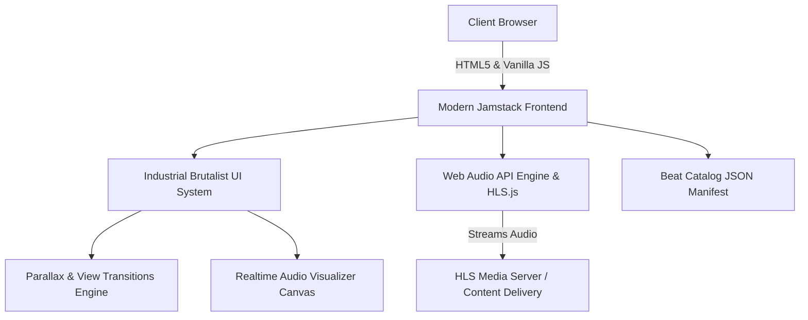

# Step 1: Comprehensive Site Audit & Technical Architecture

## 1. Executive Summary & Migration Objective

The goal of this project is to completely replace the legacy WordPress platform on `rayr.cf` with a **high-impact, modern, industrial brutalist beat store and audio showcase web application**. 

The existing site relies on legacy WordPress components (Hestia Pro theme, WP-Optimize cache, FV Flowplayer, Bradmax Player, and plugin overhead) which introduce performance lag, bloated CSS/JS, and outdated UI elements. 

The new platform will be a **lightning-fast, standalone modern web application** with raw industrial aesthetics, high-contrast typography, custom Web Audio API visualizers, parallax scrolling, view transitions, and full mobile optimization.

---

## 2. Audit of Existing Assets & Structure

An analysis of `/home/rayr/Desktop/htdocs-rayr.cf` and the deployed cache reveals the following assets:

### A. Beat Catalog & Packs
| Beat Pack / Category | Status | Track / Key Data Identified | Audio Stream Type |
| :--- | :--- | :--- | :--- |
| **Beat Pack X** | Active | Max MADness, Infinity, FREAKY, SECURITY, UTO, Galaxy, bain, DR, NEO, Syn, Fever, da Tool, Dummy, b2b, Rewind, ANGY, WaTchDog, Spand, THOSE VOICES V.3, REBELS, CPER, F16, SYNISTER, Intro, TRAVI Part 1-4 | HLS Stream (`https://rayrsn.me/beat-pack-x/.../*.m3u8`) & `.key` files |
| **Beat Pack Special** | Active | Banger, STFU, the bully, X, Drip, Funky Town, Pain!, Chill Out, light, SoloDOLO, Amigo, hansolo, BreEZe, ARCANA, H808, SPY, Throw IT, FLOP, FYE, DRAKA, Bubbly 1 & 2, Basalt | HLS Stream (`https://rayrsn.me/beat-pack-special/.../*.m3u8`) & `.key` files |
| **Beat Pack 8 (pt. 1 & pt. 2)** | Active | Murky, jordan, Timeless, enough, Athena, Remember Me, Malware, Azrael, Comeback, City, Create, Summer, GIVE UP, Deep Ocean, Sun Born, Enemy, Sludge, Games, Nether, Us, void, FAST LANE, DEER, alone, satan, Hustle, xenus, Candy, no sleep, Mental, Dragon, Vibe, Euphoric, Ritual, Step, On and Off, HIROSHIMA, hopeful, Mission, Future, My Head, Light, moonman | HLS Stream (`https://rayrsn.me/beat-pack-8-.../*.m3u8`) & `.key` files |
| **Beat Pack 7** | Active | Area 51, astro verse, BOUNCE, BOUNCE v.2, Defensive, DRUGS V.2, Escape, Flame, Karma, KILLA, Luck, Lust, MADNESS, NIGHTMOOD, NOSE DIVE, Queen, Swish, Wrangler, Ye | HLS Stream (`https://rayrsn.me/beat-pack-7/.../*.m3u8`) & `.key` files |
| **Beat Pack 6 (pt. 1 & pt. 2)** | Active | could be better, H.O.O.D.I.E, Belt, Juice, Lines, 1st, Our Secret, Second Side, Tonight, Nostalgic, silence, Swag, Cudi, Lonely, Pills, Those Voices v.2, WYWH 1-3, Luigi, Bands, Take Off, 95, Pharma, Over It, Before you go 1-2, Lone Star, Daemon, Righteous 1-2, Astro, Section, Musk, South, Chill, Fentanyl, Reverse, dont forget me, Brooks, Champ, Revival 1 | HLS Stream (`https://rayrsn.me/beat-pack-6/.../*.m3u8`) & `.key` files |
| **Beat Pack 5** | Active | Destined, DRUGS, Gloomy, Hats OFF, JEANS, MDMA, Nomad, Straight Up, TORNADO, West | HLS Stream (`https://rayrsn.me/...`) |
| **Beat Pack 4** | Sold Out | 365, True God, Insidiae, Midnight, Those Voices, Tlaloc, Xans | Metadata archived |
| **Beat Pack 3** | Sold Out | Control, Delusions, Fire, Identity, Lockdown, Nights, Off The Wheel | Key files in `beat-pack-3/` |
| **Beats (Single previews)** | Active | Aggressor, Bandit, Checks, Fall, Feels, JackBoys, Love, RaceCar, Rocky, Tireless | Keys in `beats/preview-keys/` |
| **New Beats** | Active | Beautiful, Boy, Centerfold, Descent, Drift, Error, LMICF, NightFire, PLVY, Prey, PxP, Reptar, Storm, TRSFA, WildSide | Keys in `new-beats/preview-keys/` |

### B. Legacy Infrastructure Bottlenecks
1. **PHP/WordPress Dependency**: Requires server-side execution, database queries, and plugin overhead (`wp-blog-header.php`, `wp-config.php`).
2. **Obsolete Audio Players**: Heavy dependence on `FV Flowplayer` (v7.4) and `Bradmax Player` which load bloated CSS/JS chunks and jQuery dependencies.
3. **Fragile Protection Rules**: Security scripts (`secure-copy-content-protection`) blocking standard browser interaction (right clicks, text selection), frustrating buyers rather than enhancing experience.

---

## 3. High-Level Architecture for the New Platform

### Key Technical Decisions:
1. **Decoupled Architecture**: Transition from PHP/WordPress to a modern static single-page client (HTML5, Modern CSS, ES Modules JavaScript or Vite/React bundle).
2. **Web Audio Engine**: Native HLS (`hls.js`) + HTML5 Audio + Web Audio API `AudioContext` for real-time waveform visualization without third-party player bloat.
3. **Data Storage**: Consolidated JSON beat manifest (`beats-manifest.json`) containing metadata (title, beat pack, bpm, key, tags, audio source, sold status, purchase links).

---

## 4. Navigation & Directory Mapping

- Audit document: [01-site-audit-and-architecture.md](file:///home/rayr/Desktop/htdocs-rayr.cf/plan/01-site-audit-and-architecture.md)
- Design system: [02-brutalist-design-system.md](file:///home/rayr/Desktop/htdocs-rayr.cf/plan/02-brutalist-design-system.md)
- Audio engine: [03-audio-engine-and-data-migration.md](file:///home/rayr/Desktop/htdocs-rayr.cf/plan/03-audio-engine-and-data-migration.md)
- Frontend build: [04-modern-frontend-implementation.md](file:///home/rayr/Desktop/htdocs-rayr.cf/plan/04-modern-frontend-implementation.md)
- Deployment: [05-deployment-and-optimization.md](file:///home/rayr/Desktop/htdocs-rayr.cf/plan/05-deployment-and-optimization.md)
