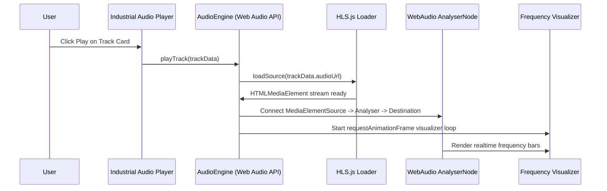

# Step 3: High-Performance Audio Engine & Data Manifest Schema

## 1. Structured Beat Manifest Schema (`beats-manifest.json`)

To eliminate database latency and WordPress server calls, all beat metadata will be compiled into a structured, lightweight JSON manifest.

```json
{
  "version": "2.0.0",
  "updatedAt": "2026-08-12",
  "artist": "Rayr",
  "beatPacks": [
    {
      "id": "beat-pack-x",
      "title": "Beat Pack X",
      "releaseDate": "2023-02-25",
      "status": "available"
    },
    {
      "id": "beat-pack-special",
      "title": "Beat Pack Special",
      "releaseDate": "2022-03-05",
      "status": "available"
    }
  ],
  "tracks": [
    {
      "id": "track-bp-x-max-madness",
      "title": "Max MADness",
      "packId": "beat-pack-x",
      "packTitle": "Beat Pack X",
      "bpm": 140,
      "key": "C Minor",
      "genre": "Trap",
      "tags": ["Trap", "Hard", "808"],
      "audioUrl": "https://rayrsn.me/beat-pack-x/Max%20MADness/Max%20MADness.m3u8",
      "status": "available",
      "duration": 154
    }
  ]
}
```

---

## 2. Web Audio API & HLS Streaming Engine



### Key Technical Specs for the Player:
1. **HLS.js Fallback Detection**: Automatically detect native HLS support in Safari or attach `HLS.js` dynamically for Chrome/Firefox/Edge.
2. **Web Audio Context Connection**:
   - `const audioCtx = new (window.AudioContext || window.webkitAudioContext)();`
   - `const source = audioCtx.createMediaElementSource(audioElement);`
   - `const analyser = audioCtx.createAnalyser();`
   - Connect `source -> analyser -> audioCtx.destination`.
3. **Canvas Spectrum Visualizer**: High FPS frequency spectrum analysis rendering industrial bars directly beneath the active track item.
4. **Keyboard Hotkeys**:
   - `Space`: Global Play/Pause toggle
   - `ArrowLeft` / `ArrowRight`: Seek 5s backward/forward
   - `M`: Toggle Mute
   - `Esc`: Close queue drawer or modals

---

## 3. Navigation & Directory Mapping

- Audit document: [01-site-audit-and-architecture.md](file:///home/rayr/Desktop/htdocs-rayr.cf/plan/01-site-audit-and-architecture.md)
- Design system: [02-brutalist-design-system.md](file:///home/rayr/Desktop/htdocs-rayr.cf/plan/02-brutalist-design-system.md)
- Audio engine: [03-audio-engine-and-data-migration.md](file:///home/rayr/Desktop/htdocs-rayr.cf/plan/03-audio-engine-and-data-migration.md)
- Frontend build: [04-modern-frontend-implementation.md](file:///home/rayr/Desktop/htdocs-rayr.cf/plan/04-modern-frontend-implementation.md)
- Deployment: [05-deployment-and-optimization.md](file:///home/rayr/Desktop/htdocs-rayr.cf/plan/05-deployment-and-optimization.md)
